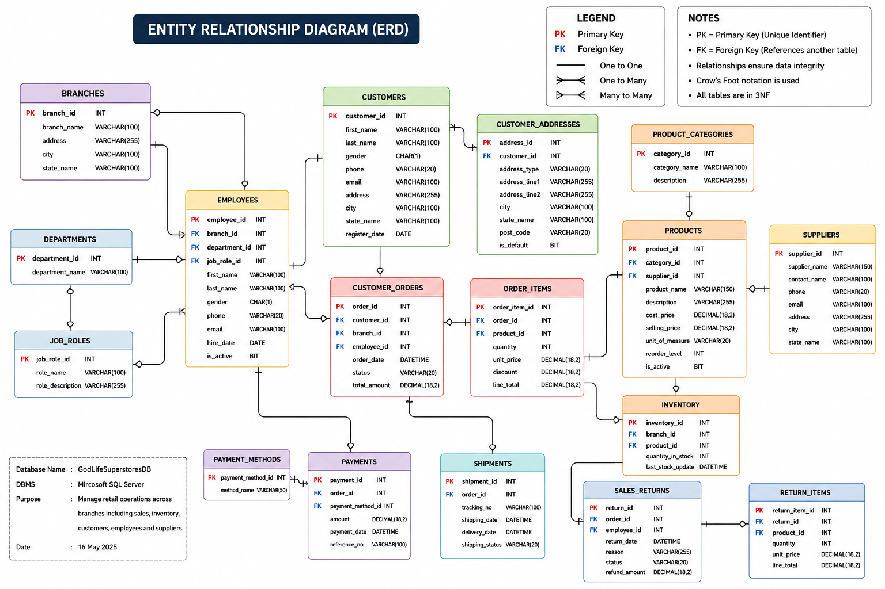

# God's Life Superstores Database


## Project Overview

God's Life Superstores Database is a professionally designed SQL Server database project that models the operations of a modern multi-branch retail supermarket.
## Entity Relationship Diagram (ERD)

The diagram below illustrates the database schema and the relationships between all entities in the God's Life Superstores Database.



The project demonstrates industry-standard database design principles, relational data modelling, SQL development, and business reporting using realistic retail business scenarios. It was created as part of my professional portfolio to showcase practical database development and analytical skills applicable to retail and business intelligence environments.

---

## Project Objectives

The primary objectives of this project are to:

- Design a normalized relational database
- Model real-world retail business processes
- Manage customers, products, inventory and suppliers
- Track sales, payments and returns
- Support business reporting and decision-making
- Demonstrate SQL Server development best practices

---

## Business Scenario

The database represents a retail organisation operating multiple supermarket branches across Nigeria.

The system manages:

- Branches
- Departments
- Employees
- Customers
- Suppliers
- Products
- Inventory
- Orders
- Payments
- Returns

The data model reflects common operational processes found in retail businesses and provides a foundation for reporting and analytics.

---

## Technologies Used

- Microsoft SQL Server
- T-SQL
- Git
- GitHub
- Microsoft Excel
- Power BI

---

## Project Structure

```
God-s-Life-Superstores-Database
│
├── README.md
│
├── Database
│   ├── Create_Database.sql
│   ├── Insert_Sample_Data.sql
│   
│
├── Queries
│   ├── Beginner.sql
│   ├── Intermediate.sql
│   ├── Advanced.sql
│   ├── WindowFunctions.sql
│   └── BusinessInsights.sql
    └── Views.sql
│
├── Documentation
│   ├── Data_Dictionary.pdf
│   ├── Database_Design.pdf
│   └── Business_Requirements.pdf
│
├── Images
```

---

## Database Features

- Multi-branch retail management
- Customer management
- Employee management
- Product catalogue
- Supplier management
- Inventory management
- Sales processing
- Payment tracking
- Sales returns
- Business reporting

---

## Database Entities

The database includes tables such as:

- Branches
- Departments
- Employees
- Customers
- Suppliers
- Categories
- Products
- Inventory
- Orders
- Order Details
- Payments
- Returns

---

## Sample Business Questions Answered

This database supports analysis such as:

- Which branch generated the highest revenue?
- What are the top-selling products?
- Which customers spend the most?
- Which products require restocking?
- Which suppliers provide the largest number of products?
- What are monthly sales trends?
- Which employees process the most sales?
- What are the best-performing product categories?

---

## Skills Demonstrated

### Database Design

- Relational Database Design
- Data Modelling
- Normalisation
- Primary & Foreign Keys
- Constraints

### SQL Development

- Joins
- Aggregations
- Common Table Expressions (CTEs)
- Window Functions
- Views
- Stored Procedures

### Data Analysis

- Business Reporting
- Sales Analysis
- Inventory Analysis
- Customer Insights
- Trend Analysis

### Version Control

- Git
- GitHub

---

## Future Improvements

Planned enhancements include:

- Power BI dashboards
- Triggers
- Index optimisation
- Data warehouse model
- ETL workflows
- Automated reporting

## How to Use This Project

1. Download or clone the repository.
2. Open Microsoft SQL Server Management Studio.
3. Open the script in the Database folder.
4. Execute the script to create the database, tables, relationships and sample data.
5. Run the SQL files in the Queries folder to explore reports and business insights.

## Business Insights

This database can be used to analyse:

- Branch revenue performance
- Top-selling products
- Customer spending behaviour
- Inventory levels
- Low-stock products
- Employee sales performance
- Supplier contribution
- Product category performance

---

## Author

**Daniel Chibundu Onyenweaku**

Business Analyst | Data Analyst | Registered Nurse

This project forms part of my professional portfolio demonstrating practical SQL Server database development and business analysis skills.